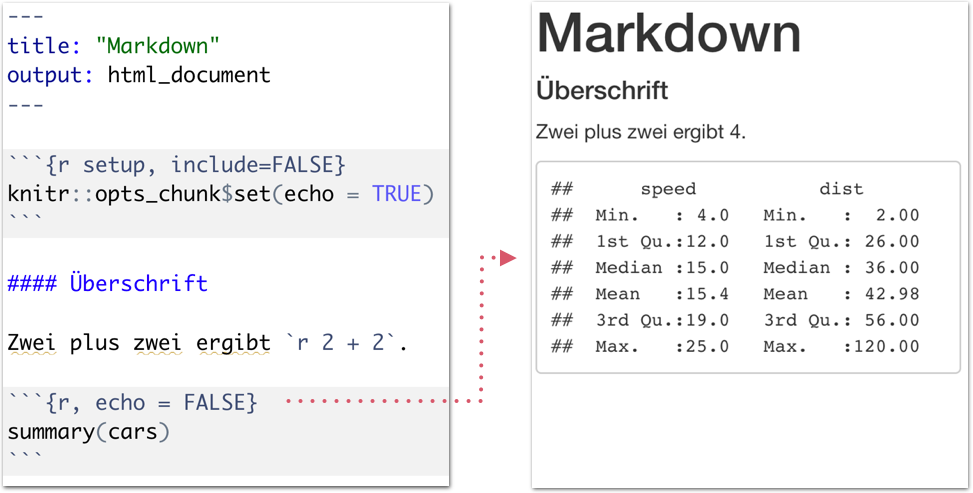
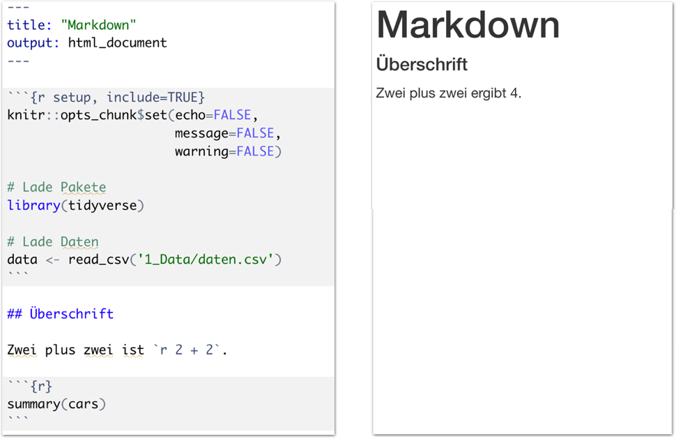
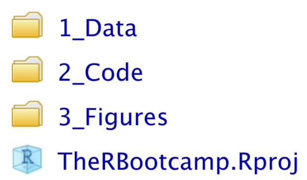

layout: true

<div class="my-footer">
  <span style="text-align:center">
    <span> 
      
    </span>
    <a href="https://dwulff.github.io/NLP_2021Autumn/">
      <span style="padding-left:82px"> 
        <font color="#7E7E7E">
          dwulff.github.io/NLP_2021Autumn
        </font>
      </span>
    </a>
    <a href="https://dwulff.github.io/NLP_2021Autumn/">
      <font color="#7E7E7E">
       NLP seminar | September 2021
      </font>
    </a>
    </span>
  </div> 


---


```{r setup, include=FALSE}
options(htmltools.dir.version = FALSE)
options(width = 110)
options(digits = 4)

# Load packages
require(tidyverse)
library(leaflet)
library(plotly)


# knitr options
knitr::opts_chunk$set(dpi = 300, echo = FALSE, warning = FALSE, fig.align = 'center', message= FALSE)

# special print function: avoid if possible
print2 <- function(x, nlines=10,...) {
   cat(head(capture.output(print(x,...)), nlines), sep="\n")}

```

# What is Markdown?

.pull-left4[

<ul>
  <li class="m1"><span>Developed by John Gruber and Aaron Swartz in 2004.<br><br>
  "<high>easy-to-read</high> and <high>easy-to-write</high> plain text format, [...] convert it to structurally valid XHTML (or HTML)"</span></li> 
  <li class="m2"><span>Simple <high>Syntax for the layout</high> of documents.</span></li>  
  <ul>
    <li><span>Text in bold and italics</span></li>   
    <li><span>Lists</span></li>  
    <li><span>Headings</span></li> 
    <li><span>Links</span></li>
    <li><span>Pictures</span></li>
  </ul>
</ul>

]

.pull-right5[

<br>

<p align = "center">
  <br>
  <font style="font-size:10px">from <a href="https://de.wikipedia.org/wiki/Markdown">wikipedia.org</a></font>
</p>

]

---

# What is RMarkdown?

.pull-left4[

<ul>
  <li class="m1"><span>Markdown is used for <high>layout of dynamic documents</high> with embedded ...</span></li><br> 
  <ul>
    <li><span>R code chunks</span></li>
    <li><span>R inline code</span></li>   
    <li><span>Output from statistical models</span></li>
    <li><span>Tables</span></li>
    <li><span>Visualization</span></li>
  </ul>
</ul>

]

.pull-right5[

<p align = "center">
  <br>
  <font style="font-size:10px">from <a href="https://rmarkdown.rstudio.com/docs/">rmarkdown.rstudio.com</a></font>
</p>

]

---

.pull-left3[

# Types of documents

<ul>
  <li class="m1"><span>RMarkdown allows the creation of different <high>document types</high>.</span></li><br>
  <ul>
    <li><span>Text documents</span></li>
    <li><span>Presentations</span></li>   
    <li><span>Dashboards (Cockpits)</span></li>
    <li><span>Books</span></li>
    <li><span>Web-Pages</span></li>
  </ul>
</ul>


]

.pull-right6[

<br><br>
<p align = "center">
  
</p>

]

---

# Components of RMarkdown

.pull-left4[

<ul>
  <li class="m1"><span>A RMarkdown script consists of multiple <high>components</high>.</span></li>
</ul>

<table style="cellspacing:0; cellpadding:0; border:none; padding-top:10px" width=100%>
  <col width="40%">
  <col width="60%">
<tr>
  <td bgcolor="white">
    <b>Component</b>
  </td>
  <td bgcolor="white">
    <b>Description</b>
  </td> 
</tr>
<tr>
  <td bgcolor="white">
  <mono>YAML</mono>
  </td>
  <td bgcolor="white">
  <b>Y</b>AML <b>A</b>in't <b>M</b>arkup <b>L</b>anguage<br>
  <high>Document setup</high>
  </td> 
</tr>
<tr>
  <td bgcolor="white">
  <mono>Setup chunk</mono>
  </td>
  <td bgcolor="white">
  <high>Chunk</high> features<br>
  <high>Packages</high> load<br>
  <high>Data</high> load
  </td> 
</tr>
<tr>
  <td bgcolor="white">
  <mono>Markdown</mono>
  </td>
  <td bgcolor="white">
  <high>Headings</high><br>
  <high>Text</high> with decoration 
  </td> 
</tr>
<tr>
  <td bgcolor="white">
  <mono>Code chunk</mono>
  </td>
  <td bgcolor="white">
  R <high>Code</high><br>
  R <high>Outputs<high>
  </td> 
</tr>
</table>

]

.pull-right5[

<p align = "center">
  
</p>

]

---

# Pipeline

.pull-left4[

<ul>
  <li class="m1"><span>One RMarkdown document can be translated into multiple output <high>formats</high>.</span></li><br>
    <ul>
    <li><span>PDF</span></li>
    <li><span>HTML</span></li>   
    <li><span>Word</span></li>
    <li><span>PowerPoint</span></li>
  </ul><br>
  <li class="m2"><span>During theses steps RMarkdown will be translated <high>multiple times</high>. This process comes with certain restrictions.</span></li><br>
</ul>

]

.pull-right5[

<p align = "center">
  
</p>

]

---

# HTML Pipeline

.pull-left4[

<ul>
  <li class="m1"><span>HTML is the <high>universal framework</high> for documents, presentations and dashboards.</span></li>
  <li class="m2"><span><high>Export to PDF</high> is possible, with minimal restrictions.</span></li><br>
</ul>

]

.pull-right5[

<p align = "center">
  
</p>

]

---

# HTML

.pull-left3[

<ul>
  <li class="m1"><span><b>H</b>yper<b>T</b>ext <b>M</b>arkup <b>L</b>anguage.</span></li>
  <li class="m2"><span>The lingua franca of the <high>World Wide Web</high>.</span></li>
  <li class="m3"><span>Can be extended with <high>CSS</high> (Cascading Style Sheets) for specialized formats.</span></li>
</ul>

]

.pull-right6[

<br>
<p align = "center">
  
</p>

]

---

# Rendering

.pull-left3[

<ul>
  <li class="m1"><span>HTML is interpreted by RStudio (or a browsern) and presented as a formatted document.</span></li>
  <li class="m2"><span><high>Rstudio</high> can show rendered documents in the viewer window. </span></li><br>
</ul>

]

.pull-right6[

<br>
<p align = "center">
  
</p>

]

---

# Headings

.pull-left3[

<ul>
  <li class="m1"><span>Different level headings are represented with one or multiple <mono>#</mono>.</span></li>
</ul>

<table style="cellspacing:0; cellpadding:0; border:none; padding-top:20px" width=100%>
  <col width="40%">
  <col width="60%">
<tr>
  <td bgcolor="white">
    <b>Markdown</b>
  </td>
  <td bgcolor="white">
    <b>Description</b>
  </td> 
</tr>
<tr>
  <td bgcolor="white">
  <mono># text</mono>
  </td>
  <td bgcolor="white">
  Level 1
  </td> 
</tr>
<tr>
  <td bgcolor="white">
  <mono>## text</mono>
  </td>
  <td bgcolor="white">
  Level 2
  </td> 
</tr>
<tr>
  <td bgcolor="white">
  <mono>...</mono>
  </td>
  <td bgcolor="white">
  ...
  </td> 
</tr>
<tr>
  <td bgcolor="white">
  <mono>##### text</mono>
  </td>
  <td bgcolor="white">
  Level 5
  </td> 
</tr>
</table>

]

.pull-right6[

<br>
<p align = "center">
  
</p>

]

---

# Headings

.pull-left3[

<ul>
  <li class="m1"><span>Different level headings are represented with one or multiple <mono>#</mono>.</span></li>
</ul>

<table style="cellspacing:0; cellpadding:0; border:none; padding-top:20px" width=100%>
  <col width="40%">
  <col width="60%">
<tr>
  <td bgcolor="white">
    <b>Markdown</b>
  </td>
  <td bgcolor="white">
    <b>Description</b>
  </td> 
</tr>
<tr>
  <td bgcolor="white">
  <mono># text</mono>
  </td>
  <td bgcolor="white">
  Level 1
  </td> 
</tr>
<tr>
  <td bgcolor="white">
  <mono>## text</mono>
  </td>
  <td bgcolor="white">
  Level 2
  </td> 
</tr>
<tr>
  <td bgcolor="white">
  <mono>...</mono>
  </td>
  <td bgcolor="white">
  ...
  </td> 
</tr>
<tr>
  <td bgcolor="white">
  <mono>##### text</mono>
  </td>
  <td bgcolor="white">
  Level 5
  </td> 
</tr>
</table>


]

.pull-right6[

<br>
<p align = "center">
  
</p>

]

---

# Emphasize text

.pull-left3[

<ul>
  <li class="m1"><span>The usage of special characters allows <high>text- and code-related</high> emphasis</span></li>
</ul>

<table style="cellspacing:0; cellpadding:0; border:none; padding-top:20px" width=100%>
  <col width="50%">
  <col width="50%">
<tr>
  <td bgcolor="white">
    <b>Markdown</b>
  </td>
  <td bgcolor="white">
    <b>Description</b>
  </td> 
</tr>
<tr>
  <td bgcolor="white">
  &ast;<mono>text</mono>&ast;
  </td>
  <td bgcolor="white">
  italic
  </td> 
</tr>
<tr>
  <td bgcolor="white">
  &ast;&ast;<mono>text</mono>&ast;&ast;
  </td>
  <td bgcolor="white">
  bold
  </td> 
</tr>
<tr>
  <td bgcolor="white">
  &ast;&ast;&ast;<mono>text</mono>&ast;&ast;&ast;
  </td>
  <td bgcolor="white">
  italic and bold 
  </td> 
</tr>
<tr>
  <td bgcolor="white">
  &grave;<mono>text</mono>&grave;
  </td>
  <td bgcolor="white">
  code
  </td> 
</tr>
<tr>
  <td bgcolor="white">
  &grave;<mono>r "text"</mono>&grave;
  </td>
  <td bgcolor="white">
  inline code
  </td> 
</tr>
</table>

]

.pull-right6[

<br>
<p align = "center">
  
</p>

]

---

# Emphasize text

.pull-left3[

<ul>
  <li class="m1"><span>The usage of special characters allows <high>text- and code-related</high> emphasis</span></li>
</ul>

<table style="cellspacing:0; cellpadding:0; border:none; padding-top:20px" width=100%>
  <col width="50%">
  <col width="50%">
<tr>
  <td bgcolor="white">
    <b>Markdown</b>
  </td>
  <td bgcolor="white">
    <b>Description</b>
  </td> 
</tr>
<tr>
  <td bgcolor="white">
  &ast;<mono>text</mono>&ast;
  </td>
  <td bgcolor="white">
  italic
  </td> 
</tr>
<tr>
  <td bgcolor="white">
  &ast;&ast;<mono>text</mono>&ast;&ast;
  </td>
  <td bgcolor="white">
  bold
  </td> 
</tr>
<tr>
  <td bgcolor="white">
  &ast;&ast;&ast;<mono>text</mono>&ast;&ast;&ast;
  </td>
  <td bgcolor="white">
  italic and bold 
  </td> 
</tr>
<tr>
  <td bgcolor="white">
  &grave;<mono>text</mono>&grave;
  </td>
  <td bgcolor="white">
  code
  </td> 
</tr>
<tr>
  <td bgcolor="white">
  &grave;<mono>r "text"</mono>&grave;
  </td>
  <td bgcolor="white">
  inline code
  </td> 
</tr>
</table>

]

.pull-right6[

<br>
<p align = "center">
  
</p>

]


---

# Emphasize text

.pull-left3[

<ul>
  <li class="m1"><span>The usage of special characters allows <high>text- and code-related</high> emphasis</span></li>
</ul>

<table style="cellspacing:0; cellpadding:0; border:none; padding-top:20px" width=100%>
  <col width="50%">
  <col width="50%">
<tr>
  <td bgcolor="white">
    <b>Markdown</b>
  </td>
  <td bgcolor="white">
    <b>Description</b>
  </td> 
</tr>
<tr>
  <td bgcolor="white">
  &ast;<mono>text</mono>&ast;
  </td>
  <td bgcolor="white">
  italic
  </td> 
</tr>
<tr>
  <td bgcolor="white">
  &ast;&ast;<mono>text</mono>&ast;&ast;
  </td>
  <td bgcolor="white">
  bold
  </td> 
</tr>
<tr>
  <td bgcolor="white">
  &ast;&ast;&ast;<mono>text</mono>&ast;&ast;&ast;
  </td>
  <td bgcolor="white">
  italic and bold 
  </td> 
</tr>
<tr>
  <td bgcolor="white">
  &grave;<mono>text</mono>&grave;
  </td>
  <td bgcolor="white">
  code
  </td> 
</tr>
<tr>
  <td bgcolor="white">
  &grave;<mono>r "text"</mono>&grave;
  </td>
  <td bgcolor="white">
  inline code
  </td> 
</tr>
</table>

]


.pull-right6[

<br>
<p align = "center">
  
</p>

]


---

# Inline Code

.pull-left3[

<ul>
  <li class="m1"><span><high>Number and word </high> can be parameterised with inline code .</span></li>
  <li class="m2"><span>inline code can contain any R code, similar to <high>code <mono>chunks</mono></high></span></li>
</ul>

]

.pull-right6[

<br>
<p align = "center">
  
</p>

]

---

# Chunks

.pull-left3[

<ul>
  <li class="m1"><span>A <high>code <mono>chunk</mono></high> can contain any R Code.</span></li>
  <li class="m2"><span>Code chunks are fine tuned with <high>additional arguments</high></span></li>
</ul>

]

.pull-right6[

<br>
<p align = "center">
  
</p>

]

---

# Chunks

.pull-left3[

<table style="cellspacing:0; cellpadding:0; border:none; padding-top:60px" width=100%>
  <col width="60%">
  <col width="40%">
<tr>
  <td bgcolor="white">
    <b>Argument</b>
  </td>
  <td bgcolor="white">
    <b>Description</b>
  </td> 
</tr>
<tr>
  <td bgcolor="white">
  <mono>echo=T/F</mono>
  </td>
  <td bgcolor="white">
  show/hide <high>code</high>
  </td> 
</tr>
<tr>
  <td bgcolor="white">
  <mono>eval=T/F</mono>
  </td>
  <td bgcolor="white">
  execute/don't execute <high>code</high>
  </td> 
</tr>
<tr>
  <td bgcolor="white">
  <mono>include=T/F</mono>
  </td>
  <td bgcolor="white">
  include/exclude <high>output</high> 
  </td> 
</tr>
<tr>
  <td bgcolor="white">
  <mono>message=T/F</mono>
  </td>
  <td bgcolor="white">
  include/exclude <highm>messages</highm>
  </td> 
</tr>
<tr>
  <td bgcolor="white">
  <mono>warning=T/F</mono>
  </td>
  <td bgcolor="white">
  include/exclude <highm>warnings</highm>
  </td> 
</tr>
</table>

<p align="center" style="font-size:12px;padding-top:10px"><mono>T/F = TRUE/FALSE</mono></p>

]

.pull-right6[

<br>
<p align = "center">
  
</p>

]


---

# Chunks

.pull-left3[

<table style="cellspacing:0; cellpadding:0; border:none; padding-top:60px" width=100%>
  <col width="60%">
  <col width="40%">
<tr>
  <td bgcolor="white">
    <b>Argument</b>
  </td>
  <td bgcolor="white">
    <b>Description</b>
  </td> 
</tr>
<tr>
  <td bgcolor="white">
  <mono>echo=T/F</mono>
  </td>
  <td bgcolor="white">
  show/hide <high>code</high>
  </td> 
</tr>
<tr>
  <td bgcolor="white">
  <mono>eval=T/F</mono>
  </td>
  <td bgcolor="white">
  execute/don't execute <high>code</high>
  </td> 
</tr>
<tr>
  <td bgcolor="white">
  <mono>include=T/F</mono>
  </td>
  <td bgcolor="white">
  include/exclude <high>output</high> 
  </td> 
</tr>
<tr>
  <td bgcolor="white">
  <mono>message=T/F</mono>
  </td>
  <td bgcolor="white">
  include/exclude <highm>messages</highm>
  </td> 
</tr>
<tr>
  <td bgcolor="white">
  <mono>warning=T/F</mono>
  </td>
  <td bgcolor="white">
  include/exclude <highm>warnings</highm>
  </td> 
</tr>
</table>

<p align="center" style="font-size:12px;padding-top:10px"><mono>T/F = TRUE/FALSE</mono></p>

]

.pull-right6[

<br>
<p align = "center">
  
</p>

]


---

# Chunks

.pull-left3[

<table style="cellspacing:0; cellpadding:0; border:none; padding-top:60px" width=100%>
  <col width="60%">
  <col width="40%">
<tr>
  <td bgcolor="white">
    <b>Argument</b>
  </td>
  <td bgcolor="white">
    <b>Description</b>
  </td> 
</tr>
<tr>
  <td bgcolor="white">
  <mono>echo=T/F</mono>
  </td>
  <td bgcolor="white">
  show/hide <high>code</high>
  </td> 
</tr>
<tr>
  <td bgcolor="white">
  <mono>eval=T/F</mono>
  </td>
  <td bgcolor="white">
  execute/don't execute <high>code</high>
  </td> 
</tr>
<tr>
  <td bgcolor="white">
  <mono>include=T/F</mono>
  </td>
  <td bgcolor="white">
  include/exclude <high>output</high> 
  </td> 
</tr>
<tr>
  <td bgcolor="white">
  <mono>message=T/F</mono>
  </td>
  <td bgcolor="white">
  include/exclude <highm>messages</highm>
  </td> 
</tr>
<tr>
  <td bgcolor="white">
  <mono>warning=T/F</mono>
  </td>
  <td bgcolor="white">
  include/exclude <highm>warnings</highm>
  </td> 
</tr>
</table>

<p align="center" style="font-size:12px;padding-top:10px"><mono>T/F = TRUE/FALSE</mono></p>

]

.pull-right6[

<br>
<p align = "center">
  
</p>

]

---

# Setup-Chunk

.pull-left3[

<ul>
  <li class="m1"><span>In the setup-chunk global <high>settings for all other chunks </high> can be defined.</span></li>
</ul>

]

.pull-right6[

<br>
<p align = "center">
  
</p>

]

---

# Setup-Chunk

.pull-left3[

<ul>
  <li class="m1"><span>In the setup-chunk global <high>settings for all other chunks </high> can be defined.</span></li>
</ul>
]

.pull-right6[

<br>
<p align = "center">
  
</p>

]


---

# Setup-Chunk

.pull-left3[

<ul>
  <li class="m1"><span>In the setup-chunk global <high>settings for all other chunks </high> can be defined.</span></li>
</ul>

]

.pull-right6[


<p align = "center">
  
</p>

]


---

# Setup-Chunk

.pull-left3[

<ul>
  <li class="m1"><span>In the setup-chunk global <high>settings for all other chunks </high> can be defined.</span></li>
</ul>

]

.pull-right6[


<p align = "center">
  
</p>

]


---

# Setup-Chunk

.pull-left3[

<ul>
  <li class="m1"><span>In the setup-chunk global <high>settings for all other chunks </high> can be defined.</span></li>
</ul>
]

.pull-right6[

<p align = "center">
  
</p>

]


---

# Relative path

.pull-left35[

<ul>
  <li class="m1"><span>Markdown documents do not access the regular <high>working directory</high>.</span></li><br>
  <li class="m2"><span>Paths in RMarkdown have to be <high>relative to the .Rmd</high> file.</span></li>
</ul>

<br>
```R
# Read Data
read_csv("../1_Data/daten.csv")
```

] 

.pull-right55[
<br>
<p align = "center">
  
</p>

]

---

class: middle, center

<h1><a href="https://dwulff.github.io/NLP_2021Autumn/menu/materials.html">Course page</a></h1>

