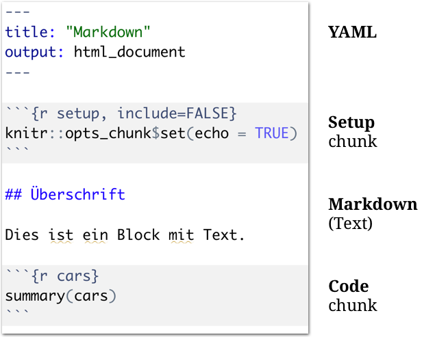
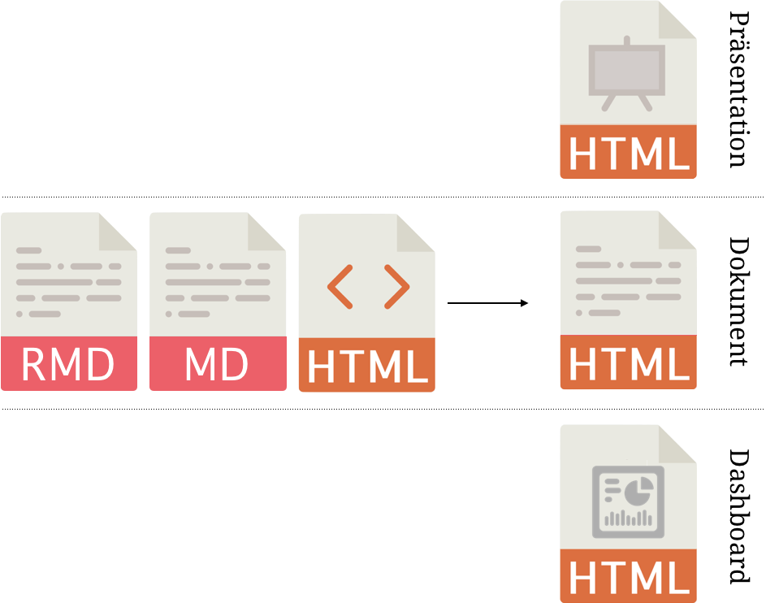
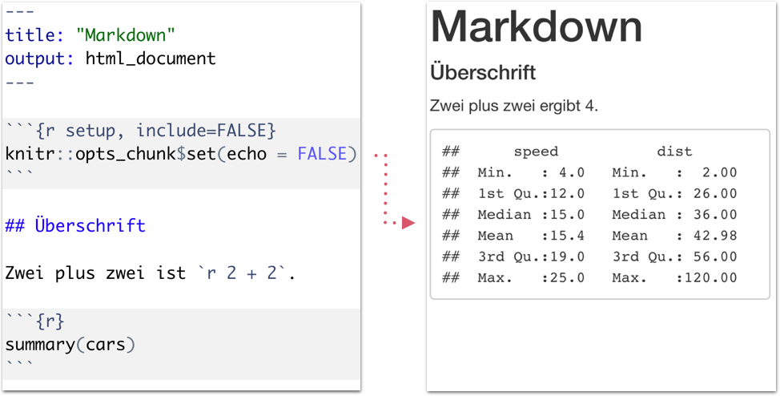
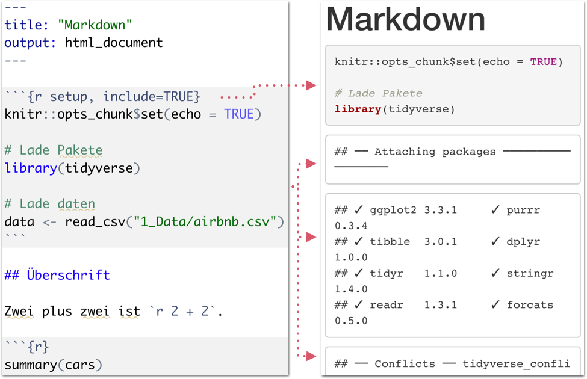

layout: true

<div class="my-footer">
  <span style="text-align:center">
    <span> 
      
    </span>
    <a href="https://dwulff.github.io/NLP_2021Autumn/">
      <span style="padding-left:82px"> 
        <font color="#7E7E7E">
          dwulff.github.io/NLP_2021Autumn
        </font>
      </span>
    </a>
    <a href="https://dwulff.github.io/NLP_2021Autumn/">
      <font color="#7E7E7E">
       NLP seminar | September 2021
      </font>
    </a>
    </span>
  </div> 


---

```{r setup, include=FALSE}
options(htmltools.dir.version = FALSE)
options(width = 110)
options(digits = 4)

# Load packages
require(tidyverse)
library(leaflet)
library(plotly)

# load color set
#source("../../_materials/palette/therbootcamp_palettes.R")

# knitr options
knitr::opts_chunk$set(dpi = 300, echo = FALSE, warning = FALSE, fig.align = 'center', message= FALSE)

# special print function: avoid if possible
print2 <- function(x, nlines=10,...) {
   cat(head(capture.output(print(x,...)), nlines), sep="\n")}

```

# Was ist Markdown?

.pull-left4[

<ul>
  <li class="m1"><span>Entwickelt von John Gruber and Aaron Swartz in 2004.<br><br>
  "<high>easy-to-read</high> and <high>easy-to-write</high> plain text format, [...] convert it to structurally valid XHTML (or HTML)"</span></li> 
  <li class="m2"><span>Einfache <high>Syntax für die Gestaltung</high> von Dokumenten.</span></li>  
  <ul>
    <li><span>Text in fett und kursiv</span></li>   
    <li><span>Listen</span></li>  
    <li><span>Überschriften</span></li> 
    <li><span>Links</span></li>
    <li><span>Bilder</span></li>
  </ul>
</ul>

]

.pull-right5[

<br>

<p align = "center">
  <br>
  <font style="font-size:10px">from <a href="https://de.wikipedia.org/wiki/Markdown">wikipedia.org</a></font>
</p>

]

---

# Was ist R Markdown?

.pull-left4[

<ul>
  <li class="m1"><span>Verwendet Markdown zum <high>Gestalten dynamischer Dokumente</high> mit eingebetteten...</span></li><br> 
  <ul>
    <li><span>R code chunks</span></li>
    <li><span>R inline code</span></li>   
    <li><span>Statistischen Outputs</span></li>
    <li><span>Tabellen</span></li>
    <li><span>Visualisierungen</span></li>
    <li><span>etc.</span></li>
  </ul>
</ul>

]

.pull-right5[

<p align = "center">
  <br>
  <font style="font-size:10px">from <a href="https://rmarkdown.rstudio.com/docs/">rmarkdown.rstudio.com</a></font>
</p>

]

---

.pull-left3[

# Arten des Berichts

<ul>
  <li class="m1"><span>RMarkdown ermöglicht Erstellung und Gestaltung unterschiedlicher <high>Berichttypen</high>.</span></li><br>
  <ul>
    <li><span>Dokumente</span></li>
    <li><span>Präsentationen</span></li>   
    <li><span>Dashboards (Cockpits)</span></li>
    <li><span>Bücher</span></li>
    <li><span>Webseiten</span></li>
    <li><span>etc.</span></li>
  </ul>
</ul>

]

.pull-right6[

<br><br><br>
<p align = "center">
  
</p>

]

---

# R Markdown Komponenten

.pull-left4[

<ul>
  <li class="m1"><span>RMarkdown Skripte bestehen aus mehreren <high>Komponenten</high>.</span></li>
</ul>

<table style="cellspacing:0; cellpadding:0; border:none; padding-top:10px" width=100%>
  <col width="40%">
  <col width="60%">
<tr>
  <td bgcolor="white">
    <b>Komponente</b>
  </td>
  <td bgcolor="white">
    <b>Beschreibung</b>
  </td> 
</tr>
<tr>
  <td bgcolor="white">
  <mono>YAML</mono>
  </td>
  <td bgcolor="white">
  <b>Y</b>AML <b>A</b>in't <b>M</b>arkup <b>L</b>anguage<br><br>
  <high>Dokumenteinstellungen</high>
  </td> 
</tr>
<tr>
  <td bgcolor="white">
  <mono>Setup chunk</mono>
  </td>
  <td bgcolor="white">
  <high>Chunks</high> einstellen<br>
  <high>Pakete</high> laden<br>
  <high>Daten</high> laden
  </td> 
</tr>
<tr>
  <td bgcolor="white">
  <mono>Markdown</mono>
  </td>
  <td bgcolor="white">
  <high>Überschriften</high><br>
  <high>Text</high> mit Hervorhebungen
  </td> 
</tr>
<tr>
  <td bgcolor="white">
  <mono>Code chunk</mono>
  </td>
  <td bgcolor="white">
  R <high>Code</high><br>
  R <high>Outputs<high>
  </td> 
</tr>
</table>

]

.pull-right5[

<p align = "center">
  
</p>

]

---

# Pipeline

.pull-left4[

<ul>
  <li class="m1"><span>RMarkdown kann in verschiedene <high>Dateitypen</high> übersetzt werden.</span></li><br>
    <ul>
    <li><span>PDF</span></li>
    <li><span>HTML</span></li>   
    <li><span>Word</span></li>
    <li><span>PowerPoint</span></li>
  </ul><br>
  <li class="m2"><span>Für die Übersetzung wird <high>RMarkdown mehrfach übersetzt</high>, was gewisse Einschränkungen mit sich bringt.</span></li><br>
</ul>

]

.pull-right5[

<p align = "center">
  
</p>

]

---

# HTML Pipeline

.pull-left4[

<ul>
  <li class="m1"><span>HTML ist der <high>universelle Framework</high> für Dokumente, Präsentationen, und v.a. Dashboards.</span></li>
  <li class="m2"><span><high>Export zu PDF</high> ist, mit minimalen Einschränkungen, möglich.</span></li><br>
</ul>

]

.pull-right5[

<p align = "center">
  
</p>

]

---

# HTML

.pull-left3[

<ul>
  <li class="m1"><span><b>H</b>yper<b>T</b>ext <b>M</b>arkup <b>L</b>anguage.</span></li>
  <li class="m2"><span>Das Format des <high>World Wide Webs</high>.</span></li>
  <li class="m3"><span>Kann komfortabel durch <high>CSS</high> (Cascading Style Sheets) formartiert werden.</span></li>
</ul>

]

.pull-right6[

<br>
<p align = "center">
  
</p>

]

---

# R Markdown

.pull-left3[

<ul>
  <li class="m1"><span>HTML ist der <high>universelle Framework</high> für Dokumente, Präsentationen, und v.a. Dashboards.</span></li>
  <li class="m2"><span><high>Export zu PDF</high> ist, mit minimalen Einschränkungen, möglich.</span></li><br>
</ul>

]

.pull-right6[

<br>
<p align = "center">
  
</p>

]

---

# Überschriften

.pull-left3[

<ul>
  <li class="m1"><span>Überschriften verschiedener <high>Ebenen</high> werden durch verschieden viele <mono>#</mono> ausgedrückt.</span></li>
</ul>

<table style="cellspacing:0; cellpadding:0; border:none; padding-top:20px" width=100%>
  <col width="40%">
  <col width="60%">
<tr>
  <td bgcolor="white">
    <b>Markdown</b>
  </td>
  <td bgcolor="white">
    <b>Beschreibung</b>
  </td> 
</tr>
<tr>
  <td bgcolor="white">
  <mono># text</mono>
  </td>
  <td bgcolor="white">
  Ebene 1
  </td> 
</tr>
<tr>
  <td bgcolor="white">
  <mono>## text</mono>
  </td>
  <td bgcolor="white">
  Ebene 2
  </td> 
</tr>
<tr>
  <td bgcolor="white">
  <mono>...</mono>
  </td>
  <td bgcolor="white">
  ...
  </td> 
</tr>
<tr>
  <td bgcolor="white">
  <mono>##### txt</mono>
  </td>
  <td bgcolor="white">
  Ebene 5
  </td> 
</tr>
</table>

]

.pull-right6[

<br>
<p align = "center">
  
</p>

]

---

# Überschriften

.pull-left3[

<ul>
  <li class="m1"><span>Überschriften verschiedener <high>Ebenen</high> werden durch verschieden viele <mono>#</mono> ausgedrückt.</span></li>
</ul>

<table style="cellspacing:0; cellpadding:0; border:none; padding-top:20px" width=100%>
  <col width="40%">
  <col width="60%">
<tr>
  <td bgcolor="white">
    <b>Markdown</b>
  </td>
  <td bgcolor="white">
    <b>Beschreibung</b>
  </td> 
</tr>
<tr>
  <td bgcolor="white">
  <mono># text</mono>
  </td>
  <td bgcolor="white">
  Ebene 1
  </td> 
</tr>
<tr>
  <td bgcolor="white">
  <mono>## text</mono>
  </td>
  <td bgcolor="white">
  Ebene 2
  </td> 
</tr>
<tr>
  <td bgcolor="white">
  <mono>...</mono>
  </td>
  <td bgcolor="white">
  ...
  </td> 
</tr>
<tr>
  <td bgcolor="white">
  <mono>##### txt</mono>
  </td>
  <td bgcolor="white">
  Ebene 5
  </td> 
</tr>
</table>

]

.pull-right6[

<br>
<p align = "center">
  
</p>

]

---

# Hervorhebung

.pull-left3[

<ul>
  <li class="m1"><span>Verschiedene Zeichen erlauben <high>text- und code-bezogene</high> Hervorhebungen.</span></li>
</ul>

<table style="cellspacing:0; cellpadding:0; border:none; padding-top:20px" width=100%>
  <col width="50%">
  <col width="50%">
<tr>
  <td bgcolor="white">
    <b>Markdown</b>
  </td>
  <td bgcolor="white">
    <b>Beschreibung</b>
  </td> 
</tr>
<tr>
  <td bgcolor="white">
  &ast;<mono>text</mono>&ast;
  </td>
  <td bgcolor="white">
  Kursiv
  </td> 
</tr>
<tr>
  <td bgcolor="white">
  &ast;&ast;<mono>text</mono>&ast;&ast;
  </td>
  <td bgcolor="white">
  Fett
  </td> 
</tr>
<tr>
  <td bgcolor="white">
  &ast;&ast;&ast;<mono>text</mono>&ast;&ast;&ast;
  </td>
  <td bgcolor="white">
  Kursiv und Fett 
  </td> 
</tr>
<tr>
  <td bgcolor="white">
  &grave;<mono>text</mono>&grave;
  </td>
  <td bgcolor="white">
  Code
  </td> 
</tr>
<tr>
  <td bgcolor="white">
  &grave;<mono>r "text"</mono>&grave;
  </td>
  <td bgcolor="white">
  inline Code
  </td> 
</tr>
</table>

]

.pull-right6[

<br>
<p align = "center">
  
</p>

]

---

# Hervorhebung

.pull-left3[

<ul>
  <li class="m1"><span>Verschiedene Zeichen erlauben <high>text- und code-bezogene</high> Hervorhebungen.</span></li>
</ul>

<table style="cellspacing:0; cellpadding:0; border:none; padding-top:20px" width=100%>
  <col width="50%">
  <col width="50%">
<tr>
  <td bgcolor="white">
    <b>Markdown</b>
  </td>
  <td bgcolor="white">
    <b>Beschreibung</b>
  </td> 
</tr>
<tr>
  <td bgcolor="white">
  &ast;<mono>text</mono>&ast;
  </td>
  <td bgcolor="white">
  Kursiv
  </td> 
</tr>
<tr>
  <td bgcolor="white">
  &ast;&ast;<mono>text</mono>&ast;&ast;
  </td>
  <td bgcolor="white">
  Fett
  </td> 
</tr>
<tr>
  <td bgcolor="white">
  &ast;&ast;&ast;<mono>text</mono>&ast;&ast;&ast;
  </td>
  <td bgcolor="white">
  Kursiv und Fett 
  </td> 
</tr>
<tr>
  <td bgcolor="white">
  &grave;<mono>text</mono>&grave;
  </td>
  <td bgcolor="white">
  Code
  </td> 
</tr>
<tr>
  <td bgcolor="white">
  &grave;<mono>r "text"</mono>&grave;
  </td>
  <td bgcolor="white">
  inline Code
  </td> 
</tr>
</table>

]

.pull-right6[

<br>
<p align = "center">
  
</p>

]


---

# Hervorhebung

.pull-left3[

<ul>
  <li class="m1"><span>Verschiedene Zeichen erlauben <high>text- und code-bezogene</high> Hervorhebungen.</span></li>
</ul>

<table style="cellspacing:0; cellpadding:0; border:none; padding-top:20px" width=100%>
  <col width="50%">
  <col width="50%">
<tr>
  <td bgcolor="white">
    <b>Markdown</b>
  </td>
  <td bgcolor="white">
    <b>Beschreibung</b>
  </td> 
</tr>
<tr>
  <td bgcolor="white">
  &ast;<mono>text</mono>&ast;
  </td>
  <td bgcolor="white">
  Kursiv
  </td> 
</tr>
<tr>
  <td bgcolor="white">
  &ast;&ast;<mono>text</mono>&ast;&ast;
  </td>
  <td bgcolor="white">
  Fett
  </td> 
</tr>
<tr>
  <td bgcolor="white">
  &ast;&ast;&ast;<mono>text</mono>&ast;&ast;&ast;
  </td>
  <td bgcolor="white">
  Kursiv und Fett 
  </td> 
</tr>
<tr>
  <td bgcolor="white">
  &grave;<mono>text</mono>&grave;
  </td>
  <td bgcolor="white">
  Code
  </td> 
</tr>
<tr>
  <td bgcolor="white">
  &grave;<mono>r "text"</mono>&grave;
  </td>
  <td bgcolor="white">
  inline Code
  </td> 
</tr>
</table>

]


.pull-right6[

<br>
<p align = "center">
  
</p>

]


---

# Inline Code

.pull-left3[

<ul>
  <li class="m1"><span><high>Zahlen und Wörter</high> im Text können durch inline Code parametrisiert werden.</span></li>
  <li class="m2"><span>inline Code kann wie ein <high>Code <mono>chunks</mono></high> beliebigen R Code enthalten.</span></li>
</ul>

]

.pull-right6[

<br>
<p align = "center">
  
</p>

]

---

# Chunks

.pull-left3[

<ul>
  <li class="m1"><span><high>Zahlen und Wörter</high> im Text können durch inline Code parametrisiert werden.</span></li>
  <li class="m2"><span>inline Code kann wie ein <high>Code <mono>chunks</mono></high> beliebigen R Code enthalten.</span></li>
</ul>

]

.pull-right6[

<br>
<p align = "center">
  
</p>

]

---

# Chunks

.pull-left3[

<table style="cellspacing:0; cellpadding:0; border:none; padding-top:60px" width=100%>
  <col width="60%">
  <col width="40%">
<tr>
  <td bgcolor="white">
    <b>Markdown</b>
  </td>
  <td bgcolor="white">
    <b>Beschreibung</b>
  </td> 
</tr>
<tr>
  <td bgcolor="white">
  <mono>echo=T/F</mono>
  </td>
  <td bgcolor="white">
  Zeige/Verstecke <high>Code</high>
  </td> 
</tr>
<tr>
  <td bgcolor="white">
  <mono>eval=T/F</mono>
  </td>
  <td bgcolor="white">
  <high>Code</high> ausführen/nicht-ausf.
  </td> 
</tr>
<tr>
  <td bgcolor="white">
  <mono>include=T/F</mono>
  </td>
  <td bgcolor="white">
  Inkludiere/exkludiere <high>allen Output</high> 
  </td> 
</tr>
<tr>
  <td bgcolor="white">
  <mono>message=T/F</mono>
  </td>
  <td bgcolor="white">
  Inkludiere/exkludiere <highm>messages</highm> im Output
  </td> 
</tr>
<tr>
  <td bgcolor="white">
  <mono>warning=T/F</mono>
  </td>
  <td bgcolor="white">
  Inkludiere/exkludiere <highm>warnings</highm> im Output
  </td> 
</tr>
</table>

<p align="center" style="font-size:12px;padding-top:10px"><mono>T/F = TRUE/FALSE</mono></p>

]

.pull-right6[

<br>
<p align = "center">
  
</p>

]


---

# Chunks

.pull-left3[

<table style="cellspacing:0; cellpadding:0; border:none; padding-top:60px" width=100%>
  <col width="60%">
  <col width="40%">
<tr>
  <td bgcolor="white">
    <b>Markdown</b>
  </td>
  <td bgcolor="white">
    <b>Beschreibung</b>
  </td> 
</tr>
<tr>
  <td bgcolor="white">
  <mono>echo=T/F</mono>
  </td>
  <td bgcolor="white">
  Zeige/Verstecke <high>Code</high>
  </td> 
</tr>
<tr>
  <td bgcolor="white">
  <mono>eval=T/F</mono>
  </td>
  <td bgcolor="white">
  <high>Code</high> ausführen/nicht-ausf.
  </td> 
</tr>
<tr>
  <td bgcolor="white">
  <mono>include=T/F</mono>
  </td>
  <td bgcolor="white">
  Inkludiere/exkludiere <high>allen Output</high> 
  </td> 
</tr>
<tr>
  <td bgcolor="white">
  <mono>message=T/F</mono>
  </td>
  <td bgcolor="white">
  Inkludiere/exkludiere <highm>messages</highm> im Output
  </td> 
</tr>
<tr>
  <td bgcolor="white">
  <mono>warning=T/F</mono>
  </td>
  <td bgcolor="white">
  Inkludiere/exkludiere <highm>warnings</highm> im Output
  </td> 
</tr>
</table>

<p align="center" style="font-size:12px;padding-top:10px"><mono>T/F = TRUE/FALSE</mono></p>

]

.pull-right6[

<br>
<p align = "center">
  
</p>

]


---

# Chunks

.pull-left3[

<table style="cellspacing:0; cellpadding:0; border:none; padding-top:60px" width=100%>
  <col width="60%">
  <col width="40%">
<tr>
  <td bgcolor="white">
    <b>Markdown</b>
  </td>
  <td bgcolor="white">
    <b>Beschreibung</b>
  </td> 
</tr>
<tr>
  <td bgcolor="white">
  <mono>echo=T/F</mono>
  </td>
  <td bgcolor="white">
  Zeige/Verstecke <high>Code</high>
  </td> 
</tr>
<tr>
  <td bgcolor="white">
  <mono>eval=T/F</mono>
  </td>
  <td bgcolor="white">
  <high>Code</high> ausführen/nicht-ausf.
  </td> 
</tr>
<tr>
  <td bgcolor="white">
  <mono>include=T/F</mono>
  </td>
  <td bgcolor="white">
  Inkludiere/exkludiere <high>allen Output</high> 
  </td> 
</tr>
<tr>
  <td bgcolor="white">
  <mono>message=T/F</mono>
  </td>
  <td bgcolor="white">
  Inkludiere/exkludiere <highm>messages</highm> im Output
  </td> 
</tr>
<tr>
  <td bgcolor="white">
  <mono>warning=T/F</mono>
  </td>
  <td bgcolor="white">
  Inkludiere/exkludiere <highm>warnings</highm> im Output
  </td> 
</tr>
</table>

<p align="center" style="font-size:12px;padding-top:10px"><mono>T/F = TRUE/FALSE</mono></p>

]

.pull-right6[

<br>
<p align = "center">
  
</p>

]

---

# Setup-Chunk

.pull-left3[

<ul>
  <li class="m1"><span>Im Setup-Chunk können <high>Settings für alle Chunks</high> definiert werden vorgenommen werden.</span></li>
  <li class="m2"><span>Weiterführende Funktionen verfügbar.</span></li>
</ul>

]

.pull-right6[

<br>
<p align = "center">
  
</p>

]

---

# Setup-Chunk

.pull-left3[

<ul>
  <li class="m1"><span>Im Setup-Chunk können <high>Settings für alle Chunks</high> vorgenommen werden.</span></li>
  <li class="m2"><span>Weiterführende Funktionen verfügbar.</span></li>
</ul>

]

.pull-right6[

<br>
<p align = "center">
  
</p>

]


---

# Setup-Chunk

.pull-left3[

<ul>
  <li class="m1"><span>Im Setup-Chunk können <high>Settings für alle Chunks</high> vorgenommen werden.</span></li>
  <li class="m2"><span>Weiterführende Funktionen verfügbar.</span></li>
</ul>

]

.pull-right6[


<p align = "center">
  
</p>

]


---

# Setup-Chunk

.pull-left3[

<ul>
  <li class="m1"><span>Im Setup-Chunk können <high>Settings für alle Chunks</high> vorgenommen werden.</span></li>
  <li class="m2"><span>Weiterführende Funktionen verfügbar.</span></li>
</ul>

]

.pull-right6[


<p align = "center">
  
</p>

]


---

# Setup-Chunk

.pull-left3[

<ul>
  <li class="m1"><span>Im Setup-Chunk können <high>Settings für alle Chunks</high> vorgenommen werden.</span></li>
  <li class="m2"><span>Weiterführende Funktionen verfügbar.</span></li>
</ul>

]

.pull-right6[

<p align = "center">
  
</p>

]


---

# Relativer Pfad

.pull-left35[

<ul>
  <li class="m1"><span>Markdown Dokumente greifen nicht auf das übliche <high>working directory</high> zu.</span></li><br>
  <li class="m2"><span>Pfade in RMarkdown müssen <high>relativ zur Position des .Rmd</high> Datei definiert werden.</span></li>
</ul>

<br>
```R
# Lese Daten
read_csv("../1_Data/daten.csv")

# Lese CSS (mehr dazu später)
css: "../2_Assets/styling.csv")
```

]

.pull-right55[
<br>
<p align = "center">
  
</p>

]


---

class: middle, center

<h1><a href=https://dwulff.github.io/NLP_2021Autumn/menu/materials.html>Materials</a></h1>

